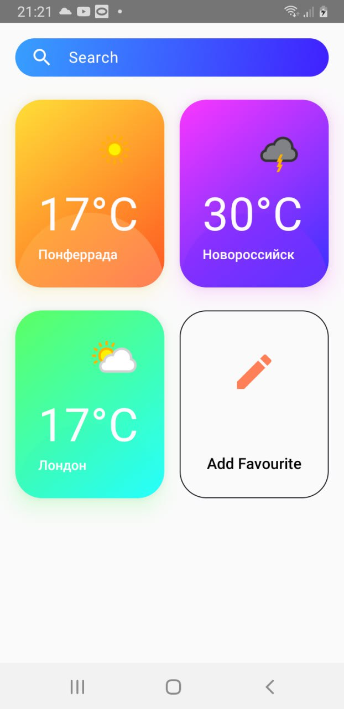
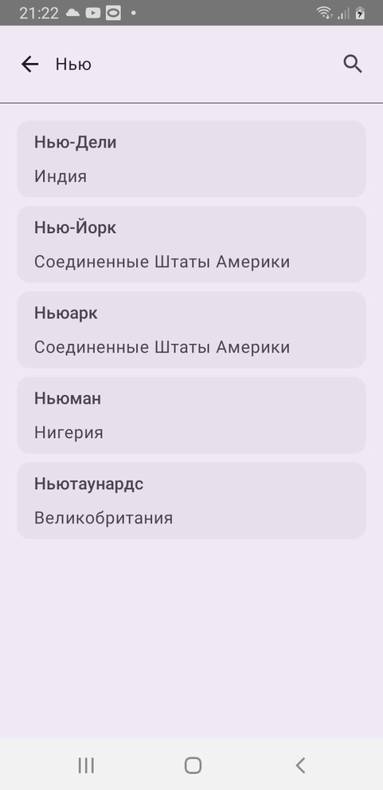
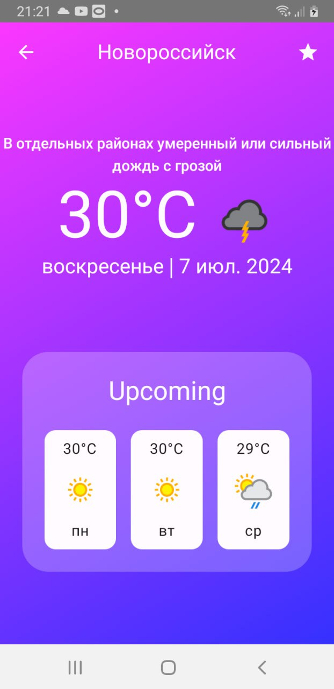

# WeatherApp (Погодное приложение)
Учебное приложение (изучение Jetpack Compose)

Android-приложение, которое представляет собой погодное приложение, используя данные от сайта weatherapi.com. В этом приложении три экрана: избранные города, поисковик городов и детальная информация о погоде конкретного города с прогнозом на три дня.

Стек
-
Jetpack Compose, Room, Glide (Compose), Kotlinx Serialization, Dagger2, Flow, MVIKotlin, Retrofit, Decompose

Внешность
-

| Избранные | Поиск | Детальная информация |
|:-:|:-:|:-:|
||||

## Инструкции по сборке проекта

В файл gradle.properties необходимо добавить ваш apikey в следующем формате

apikey=YOUR_API_KEY
